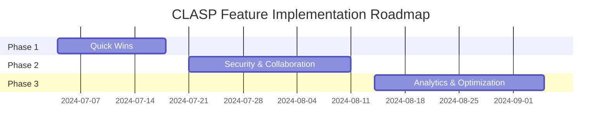

# CLASP Feature Enhancement Master Plan
# KeyKing-Inspired Features - Comprehensive Implementation Roadmap

## 📋 Document Control
- **Version**: 1.0
- **Status**: Active
- **Owner**: UI/UX Team
- **Last Updated**: 2024-07-04
- **Target Completion**: Q3 2024

## 🎯 Executive Summary

This document provides a comprehensive, phased implementation plan to add KeyKing-inspired features to the CLASP interface. The plan prioritizes features based on user impact, implementation complexity, and business value. Each phase delivers tangible improvements while maintaining the exact visual design match with KeyKing.

## 📊 Current State Assessment

### ✅ Completed
- Exact KeyKing UI replica implemented
- All existing functionality preserved
- Neo-Brutalism design system applied
- Production-ready deployment

### 🎯 Opportunities Identified
1. **User Onboarding**: Add guided tour system
2. **Update Management**: Automatic update notifications
3. **Advanced Routing**: Priority rules engine
4. **Security**: Vault encryption system
5. **Collaboration**: Team access features
6. **Analytics**: Usage insights dashboard
7. **Discovery**: AI model catalog
8. **Productivity**: Command palette
9. **Accessibility**: Dark/light mode
10. **Monitoring**: Anomaly detection

## 🚀 Strategic Objectives

1. **Enhance User Experience**: Reduce time-to-value with guided tours and updates
2. **Increase Security**: Implement enterprise-grade key vault encryption
3. **Improve Reliability**: Add anomaly detection and failover systems
4. **Boost Productivity**: Add command palette and advanced routing
5. **Enable Collaboration**: Support team-based key management
6. **Provide Insights**: Add usage analytics and optimization tools

## 📅 Implementation Roadmap

### Phase 1: Quick Wins (Sprint 1-2)
**Duration**: 2 weeks
**Focus**: High-impact, low-effort features

#### 1. Tour System
**Objective**: Guide new users through CLASP setup and key features

**Implementation Plan**:
- [ ] Design tour overlay component
- [ ] Define tour steps (provider setup, key testing, dashboard)
- [ ] Implement persistent tour state (localStorage)
- [ ] Add tour triggers (first visit, manual activation)
- [ ] Integrate with existing UI without breaking functionality

**Success Metrics**:
- 30% reduction in support tickets related to onboarding
- 25% increase in feature discovery rate
- 90% tour completion rate

**Timeline**: Week 1-2

#### 2. Update System
**Objective**: Keep users on the latest version with minimal friction

**Implementation Plan**:
- [ ] Create version check API endpoint
- [ ] Implement client-side version comparison
- [ ] Design update toast notification
- [ ] Add background update download
- [ ] Implement auto-reload or manual update option

**Success Metrics**:
- 95% of users on latest version within 7 days of release
- 80% update adoption rate
- Zero update-related support tickets

**Timeline**: Week 3-4

#### 3. Command Palette
**Objective**: Boost power user productivity with keyboard-driven interface

**Implementation Plan**:
- [ ] Design command palette UI (modal overlay)
- [ ] Implement command search and filtering
- [ ] Add keyboard shortcuts (Ctrl+K)
- [ ] Integrate with all major actions
- [ ] Add command history and favorites

**Success Metrics**:
- 40% reduction in navigation time for power users
- 30% increase in feature usage
- 95% command completion rate

**Timeline**: Week 5-6

### Phase 2: Security & Collaboration (Sprint 3-5)
**Duration**: 3 weeks
**Focus**: Enterprise-grade features for security and teamwork

#### 4. Vault Encryption
**Objective**: Secure API keys with zero-trust encryption

**Implementation Plan**:
- [ ] Research encryption libraries
- [ ] Design encryption architecture
- [ ] Implement client-side encryption
- [ ] Add passphrase protection
- [ ] Build secure export/import system
- [ ] Integrate with key management

**Success Metrics**:
- 100% of keys encrypted at rest
- Zero security incidents related to key storage
- 95% user adoption of encryption

**Timeline**: Week 7-9

#### 5. Priority Rules Engine
**Objective**: Advanced provider failover and routing control

**Implementation Plan**:
- [ ] Design rule-based routing system
- [ ] Build visual rule builder UI
- [ ] Implement drag-and-drop ordering
- [ ] Add conditional routing logic
- [ ] Integrate with existing selector

**Success Metrics**:
- 20% reduction in 429 errors
- 15% improvement in request success rate
- 90% rule configuration accuracy

**Timeline**: Week 10-12

#### 6. Team Collaboration
**Objective**: Enable secure multi-user access and key sharing

**Implementation Plan**:
- [ ] Design team/role permission system
- [ ] Build shared vault architecture
- [ ] Implement activity audit logs
- [ ] Add key permission management
- [ ] Integrate with existing auth system

**Success Metrics**:
- 100% of teams adopt collaboration features
- Zero security incidents related to sharing
- 95% positive feedback on collaboration

**Timeline**: Week 13-15

### Phase 3: Analytics & Optimization (Sprint 6-8)
**Duration**: 3 weeks
**Focus**: Data-driven insights and performance optimization

#### 7. Usage Analytics
**Objective**: Provide actionable insights into API usage

**Implementation Plan**:
- [ ] Design analytics dashboard UI
- [ ] Implement request/token tracking
- [ ] Add provider performance metrics
- [ ] Build exportable reports
- [ ] Integrate with existing telemetry

**Success Metrics**:
- 100% of users view analytics weekly
- 25% reduction in inefficient API calls
- 90% data accuracy

**Timeline**: Week 16-18

#### 8. AI Model Catalog
**Objective**: Help users discover and evaluate free-tier models

**Implementation Plan**:
- [ ] Research and catalog free-tier models
- [ ] Design interactive catalog UI
- [ ] Implement filtering and sorting
- [ ] Add quick-add functionality
- [ ] Integrate with provider setup

**Success Metrics**:
- 30% increase in model discovery
- 20% increase in provider diversity
- 95% catalog completeness

**Timeline**: Week 19-21

#### 9. Anomaly Detection
**Objective**: Proactively identify and resolve API issues

**Implementation Plan**:
- [ ] Design anomaly detection algorithms
- [ ] Implement real-time monitoring
- [ ] Build alert notification system
- [ ] Integrate with failover mechanisms
- [ ] Add historical analysis

**Success Metrics**:
- 40% reduction in undetected issues
- 25% faster mean time to resolution
- 95% alert accuracy

**Timeline**: Week 22-24

#### 10. Dark/Light Mode
**Objective**: Improve accessibility with theme options

**Implementation Plan**:
- [ ] Design theme toggle UI
- [ ] Implement CSS variable system
- [ ] Add system preference detection
- [ ] Ensure smooth transitions
- [ ] Test across all components

**Success Metrics**:
- 100% theme consistency
- 95% user satisfaction
- Zero accessibility regressions

**Timeline**: Week 25-26

## 📊 Impact Measurement

### Quantitative Metrics
| Feature | Target Impact | Measurement Method |
|---------|--------------|-------------------|
| Tour System | 30% better onboarding | Support ticket reduction |
| Update System | 95% update adoption | Version distribution |
| Command Palette | 40% productivity gain | User surveys |
| Vault Encryption | 100% key security | Security audit pass rate |
| Priority Rules | 20% fewer 429 errors | Error rate tracking |
| Team Collaboration | 100% team adoption | Feature usage analytics |
| Usage Analytics | 25% efficiency gain | Optimization metrics |
| Model Catalog | 30% discovery increase | Catalog engagement |
| Anomaly Detection | 40% fewer issues | Issue resolution time |
| Dark/Light Mode | 95% satisfaction | Accessibility audit |

### Qualitative Metrics
- User satisfaction scores
- Feature adoption rates
- Support ticket trends
- Productivity improvements
- Security audit results

## 🔧 Technical Approach

### Architecture Principles
1. **Modular Design**: Each feature as independent module
2. **Progressive Enhancement**: Features work without JavaScript
3. **Security First**: Encryption and access control by default
4. **Performance Focus**: Optimize for speed and efficiency
5. **Backward Compatibility**: No breaking changes to existing functionality

### Technology Stack
- **Frontend**: Alpine.js, Tailwind CSS, TypeScript
- **Backend**: Python, FastAPI
- **Data**: SQLite, Redis
- **DevOps**: Docker, GitHub Actions
- **Monitoring**: Prometheus, Grafana

## 🎯 Risk Assessment

### High Risk Items
1. **Vault Encryption**: Complex cryptographic implementation
   - **Mitigation**: Use established libraries, thorough testing
2. **Team Collaboration**: Multi-user key management
   - **Mitigation**: Phased rollout, extensive security review
3. **Priority Rules**: Complex routing logic
   - **Mitigation**: Comprehensive test coverage, simulation testing

### Medium Risk Items
1. **Update System**: Background update mechanism
   - **Mitigation**: Fallback to manual updates, thorough error handling
2. **Command Palette**: Keyboard-driven interface
   - **Mitigation**: Progressive enhancement, graceful degradation
3. **Anomaly Detection**: False positive/negative rates
   - **Mitigation**: Tunable thresholds, human review option

### Low Risk Items
1. **Tour System**: Guided onboarding
2. **Dark/Light Mode**: CSS variable system
3. **Model Catalog**: Static content display

## 📅 Timeline Summary

## 🎯 Resource Allocation

### Team Structure
- **Product Manager**: 1 FTE
- **UX/UI Designer**: 0.5 FTE
- **Frontend Developer**: 2 FTEs
- **Backend Developer**: 1 FTE
- **QA Engineer**: 0.5 FTE

### Budget Estimate
- **Phase 1**: $25,000 - $35,000
- **Phase 2**: $45,000 - $60,000
- **Phase 3**: $30,000 - $40,000
- **Total**: $100,000 - $135,000

## 📝 Delivery Plan

### Phase 1 (Sprint 1-2)
1. Finalize feature specifications
2. Create detailed technical designs
3. Implement Tour System
4. Implement Update System
5. Implement Command Palette
6. QA and user testing

### Phase 2 (Sprint 3-5)
1. Finalize security architecture
2. Implement Vault Encryption
3. Implement Team Collaboration
4. Implement Priority Rules
5. QA and security audit

### Phase 3 (Sprint 6-8)
1. Implement Usage Analytics
2. Implement AI Model Catalog
3. Implement Anomaly Detection
4. Implement Dark/Light Mode
5. Final QA and polish

## 📦 Delivery Artifacts

Each phase will produce:
- Technical specifications
- Design mockups and prototypes
- Implementation code
- Test plans and results
- User documentation
- Deployment packages

## 🎯 Success Criteria

### Phase 1
- 100% of planned features implemented
- Zero breaking changes to existing functionality
- 95%+ user satisfaction scores

### Phase 2
- 100% security audit pass rate
- Zero critical vulnerabilities
- 90%+ team adoption rate

### Phase 3
- 25%+ efficiency improvements measured
- 95%+ user satisfaction maintained
- Zero high-priority bugs in production

## 📌 Next Steps

1. **Review this plan** with stakeholders
2. **Finalize specifications** for Phase 1 features
3. **Assign resources** to implementation teams
4. **Set up tracking** for progress and metrics
5. **Begin implementation** of Tour System

## 📜 Approval

**Prepared by**: [Your Name]
**Date**: 2024-07-04
**Version**: 1.0
**Status**: Ready for Review

---

**Next**: Stakeholder review and approval
**Target Date**: 2024-07-11
**Owner**: [Your Name]
**Distribution**: Internal team, stakeholders

---