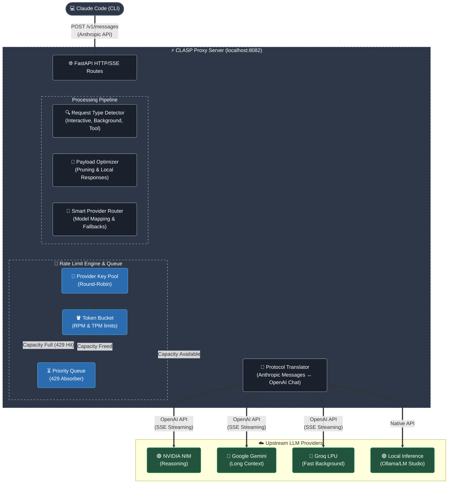

<div align="center">
  <h1>CLASP</h1>
  <p><b>Claude API Switching Proxy</b></p>
</div>

CLASP is a local LLM proxy that intercepts Anthropic API requests from Claude Code and translates them into OpenAI Chat API requests (and other provider schemas) on the fly. It maintains local state for upstream API rate limits, buffering requests in an asynchronous priority queue to prevent `429 Too Many Requests` errors from aborting Claude Code sessions.

This tool functions as an AI API gateway designed specifically for developers who want to use Claude Code with free-tier LLM endpoints (such as NVIDIA NIM, Google Gemini, Cerebras, or Groq) but are continually blocked by aggressive upstream rate limits.

**Keywords & Tags**: `Claude Code proxy`, `Anthropic API to OpenAI API translation`, `LLM rate limiting`, `429 error prevention`, `multi-provider AI gateway`, `token bucket rate limiter`.

---

## 📖 Table of Contents
- [Solving Claude Code 429 Rate Limit Errors](#solving-claude-code-429-rate-limit-errors)
- [Proxy Translation & Routing Protocol](#proxy-translation--routing-protocol)
- [Rate Limit Engine & Queue Mechanics](#rate-limit-engine--queue-mechanics)
- [Command Line Interface (CLI)](#command-line-interface-cli)
- [Supported Upstream LLM Providers](#supported-upstream-llm-providers)
- [Installation & Environment Setup](#installation--environment-setup)
- [System Architecture Diagram](#system-architecture-diagram)

---

## Solving Claude Code 429 Rate Limit Errors

Claude Code operates under the assumption that it is communicating with high-capacity Anthropic endpoints. It heavily relies on background evaluation tasks, frequent auto-formatting checks, and fast tool-use loops. 

When you configure Claude Code to hit a free-tier LLM endpoint (like Gemini 1.5 Flash via AI Studio, which limits you to 15 Requests Per Minute), the aggressive background polling triggers immediate `429 Too Many Requests` HTTP errors. Claude Code does not handle these well, often aborting the user's interactive session entirely.

## Proxy Translation & Routing Protocol

CLASP acts as a transparent intermediary running on `localhost`. You configure Claude Code to point to CLASP instead of an upstream provider. 

When a request arrives, CLASP executes the following pipeline:
1. **Protocol Translation**: Converts the Anthropic Messages request into the target provider's schema (e.g., OpenAI Chat Completion API), handling differences in System Prompts, Tool schemas, and Assistant-role thinking blocks.
2. **Local Rate Limit Evaluation**: Checks the mathematical token bucket (RPM and TPM) for the primary API provider.
3. **Queue or Route Action**: If the provider has capacity, the request is dispatched. If the provider is exhausted, CLASP cascades the request to the next provider in your fallback chain, or holds the connection open while buffering the request in a local priority queue.
4. **SSE Stream Reconstruction**: Translates the upstream provider's Server-Sent Events (SSE) back into Anthropic's expected event stream format.

Claude Code perceives a slightly delayed response rather than a hard HTTP failure.

---

## Rate Limit Engine & Queue Mechanics

### Token Bucket Rate Limiting
CLASP does not wait for an upstream provider to issue a `429` error. It uses pre-emptive local tracking via dual-dimensional Token Buckets (Requests Per Minute and Tokens Per Minute). Provider capacities are declared in `config.yaml`, and CLASP enforces a soft-threshold (e.g., 80% capacity) before it begins queueing.

### Asynchronous Priority Queuing
Requests are categorized into three tiers via the `clasp.api.detect` module:
- **Priority 0 (Interactive)**: Direct user prompts.
- **Priority 1 (Tool Use)**: Assistant tool executions and result submissions.
- **Priority 2 (Background)**: Context truncation checks, dummy pings, and token counting.

When limits are reached, requests enter an `asyncio.PriorityQueue`. An active drain task dispatches them the exact millisecond the local token bucket refills, ensuring maximum API throughput without crossing provider limits.

### Multi-Key Pooling & Circuit Breakers
Users can provide multiple API keys for a single provider to pool request quotas. CLASP instantiates a `KeyPool` for each provider, executing round-robin rotation across healthy API keys. If a key hits an unexpected 429 or 500 server error, the Circuit Breaker trips for that specific key, applying an exponential backoff algorithm while keeping the rest of the pool active.

### Local Payload Optimization
CLASP identifies and locally answers trivial requests. When Claude Code sends `/v1/models` probes or zero-generation `count_tokens` requests, CLASP returns a fabricated valid response locally. This proxy-level caching saves dozens of external API requests per session.

## Usage & CLI Commands

CLASP features a clean, Typer-powered CLI. The workflow uses two processes: a background proxy server (which hosts the dashboard and rate limit engine) and a foreground proxy wrapper that attaches Claude Code to it.

### 1. Initialization (First Run)
If this is your first time using CLASP, run the interactive setup wizard. It will create `~/.clasp/config.yaml` with sane defaults, ask you for your primary provider API keys, and automatically launch the proxy server.
```bash
$ clasp init
```

### 2. Starting the Proxy Server
Start the background server. By default, this runs on `127.0.0.1:8082` and automatically opens the visual configuration dashboard in your default browser.

```bash
$ clasp server [OPTIONS]
```
**Options:**
- `--port INTEGER`: Change the proxy port (default `8082`).
- `--host TEXT`: Change the bind address (default `127.0.0.1`).
- `--no-browser`: Start the server headless without opening the UI dashboard.
- `--live`: Renders a rich, real-time TUI (Terminal User Interface) live panel directly in the console.
- `--config PATH`: Path to a custom config file (default `~/.clasp/config.yaml`).
- `--debug`: Enable verbose debug logging for troubleshooting protocol translation.

**Expected Startup Output:**
```text
◆ CLASP v1.0.0 starting...
✓ Config loaded: ~/.clasp/config.yaml
✓ Providers: NIM (2 keys), Gemini, Cerebras, Groq  [Ollama: not detected]
✓ Proxy running at http://127.0.0.1:8082
✓ Config UI open at http://127.0.0.1:8082
→ Run `clasp claude` in another terminal to start coding.
Press Ctrl+C to stop.
```

### 3. Launching Claude Code

**Important:** You must have the proxy server running in the background before launching Claude Code. 

In a **new, separate terminal window**, run `clasp claude` to start your Claude session. This command does not spawn a subprocess shell; it uses `os.execvp()` to replace the process with the actual `claude` binary, injecting the local proxy as the Anthropic endpoint.

All standard Claude Code CLI flags are fully supported and passed through transparently:

```bash
# Start a fresh coding session
$ clasp claude

# Resume a specific session by its ID
$ clasp claude --resume abc123def456

# Continue the most recent session
$ clasp claude --continue

# Non-interactive single-shot prompt
$ clasp claude --print "refactor the ratelimit module"

# Skip the Claude Code automatic update check
$ clasp claude --no-update
```

### 4. Utility Commands

**Check System Status**
Designed for `tmux` or custom shell prompts, this command pings the local proxy socket to give you a one-line overview of the rate limit engine and active keys.
```bash
$ clasp status
[CLASP] NIM(28/40 rpm)→Gemini | Queue:0 | Keys:3/4 healthy | 1.2k req today

# Output as JSON for programmatic use
$ clasp status --json
{"status":"healthy","active_provider":"nvidia_nim","rpm_used":28,"rpm_limit":40,"queue_depth":0,"healthy_keys":3,"total_keys":4,"requests_today":1240}
```

**Graceful Shutdown**
Safely spin down the proxy. This ensures that the current queue is drained and rate limit state (cooldowns, bucket tokens) is serialized to disk (`~/.clasp/ratelimit.json`) to guarantee mathematical correctness on the next boot.
```bash
$ clasp stop
```

**Reset Circuit Breakers**
If a provider recovers early or you want to manually flush the exponential backoff cooldowns, you can force a reset.
```bash
$ clasp reset              # Reset all providers
$ clasp reset nvidia_nim   # Reset only the NVIDIA NIM circuit breakers
```

---

## Supported Upstream LLM Providers

CLASP supports strict OpenAI API compatibility out-of-the-box, alongside specialized schema mapping for providers that diverge slightly from the standard specification. 

| Provider | Free Tier Rate Limits | Network Notes |
|----------|-----------------------|---------------|
| **NVIDIA NIM** | 40 RPM | High priority for reasoning models. |
| **Google Gemini** | 15 RPM, 1M TPM | Strong fallback for large context tasks via AI Studio. |
| **Cerebras** | 30 RPM | Ultra-low latency for interactive inference. |
| **Groq** | 30 RPM | Fast LPU inference for background evaluations. |
| **OpenRouter** | Variable | Aggregates multiple downstream LLMs. |
| **Local Servers** | Hardware Bound | Native proxy routing for Ollama and LM Studio. |

---

## System Architecture Diagram



---

## Installation & Environment Setup

CLASP requires Python 3.11 or higher and uses `uv` for dependency resolution.

### 1. Clone Repository and Install
```bash
git clone https://github.com/zibranxo/clasp.git
cd clasp
uv sync
```

### 2. Configure Local Environment
Initialize the configuration file. This writes to `~/.clasp/config.yaml` and will prompt you to input your initial provider API keys.

```bash
uv run clasp init
```

### 3. Start Local Gateway
The system operates using two processes. First, start the background server to begin listening on `127.0.0.1:8082`:
```bash
uv run clasp server
```

*(Note: You do not need to install or run external services like Redis or PostgreSQL. All state is managed locally in memory.)*

State is persisted automatically. If you stop the proxy (`uv run clasp stop`), active circuit breakers and cooldown timestamps are serialized to `~/.clasp/ratelimit.json` and restored on the next boot, ensuring API quota math remains strictly accurate across server restarts.

### 4. Launch Claude Code
Once the gateway is running, open a **separate terminal window** and launch your Claude Code session through the proxy:
```bash
uv run clasp claude
```
