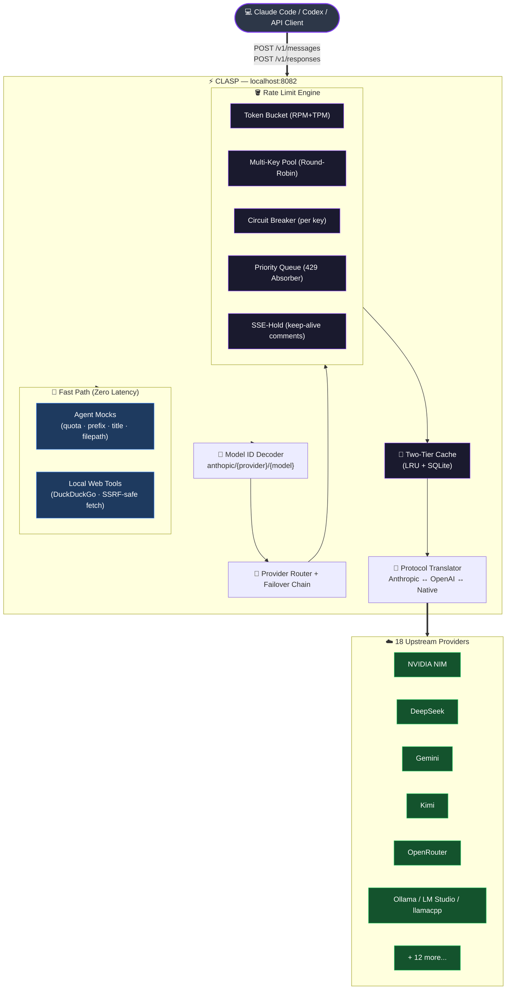

<div align="center">


<br/><br/>

# CLASP — Claude API Switching Proxy

**The rate-limit-aware, multi-provider AI gateway that lets you use Claude Code, Codex, and any Anthropic-compatible client with free-tier LLM endpoints — forever.**

[🚀 Quick Start](#-quick-start) · [📖 How It Works](#-how-it-works) · [⚙️ Configuration](#%EF%B8%8F-configuration) · [🌐 Providers](#-supported-providers-18) · [🤖 Remote Bots](#-remote-access--messaging-bots) · [🔍 SEO & Agent Discovery](#-seo--agent-discovery-index)

</div>

---

## 🧠 What is CLASP?

**CLASP** (Claude API Switching Proxy) is an open-source, production-quality local AI gateway that sits between your AI coding assistant (Claude Code, Codex, Continue.dev, etc.) and the internet. It solves the #1 problem developers face when using free-tier LLM APIs: **constant `429 Too Many Requests` errors aborting your coding session**.

CLASP routes your AI requests across **18 upstream providers**, pre-emptively tracks rate limits with a mathematical **Token Bucket engine**, and absorbs 429 errors by buffering requests in a **priority queue** — keeping your client connected and your session alive without a single interruption.

> **Zero config, zero external dependencies, zero dropped sessions.** Just plug it in and code.

---

## ✨ Feature Highlights

| Feature | Description |
|---|---|
| 🔀 **Multi-Provider Routing** | 18 upstream providers — automatically failover between them |
| 🪣 **Token Bucket Rate Limiter** | Pre-emptive RPM + TPM tracking per provider and per API key |
| 👥 **Shared Pool Mode** | Multi-tenant proxy mode with per-developer rate limits (`PerUserBucket`) |
| 🔑 **Multi-Key Pool Rotation** | Multiple API keys per provider, dynamically rotated as they cool down |
| 💾 **Three-Tier Caching** | In-memory LRU, SQLite persistence, and **Semantic Cache** (FAISS + embeddings) |
| 📡 **OpenAI Responses API** | Full `POST /v1/responses` endpoint for Codex compatibility |
| 🌐 **Local Web Tools** | `web_search` (DuckDuckGo) + `web_fetch` (SSRF-safe DNS-pinned crawler) |
| ⚡ **Agent Optimization Mocks** | Instantly answers Claude Code probes locally — zero upstream latency |
| ✂️ **Payload Optimization** | Context pruning (keep_edges), system prompt deduplication, thinking block stripping |
| 🤖 **Remote Bots** | Run Claude Code headlessly, remotely, from your phone |
| 🎙️ **Voice Transcription** | Whisper + NVIDIA NIM Riva gRPC voice-to-text for bot sessions |
| 🧩 **Dynamic Model Selector** | All 18 providers' models selectable directly from `/model` in Claude Code |
| 🛡️ **Circuit Breakers** | Per-key exponential backoff, keeps the rest of the pool alive |
| 📊 **Real-Time Dashboard** | Live TUI + Web UI showing rate limit burn, queue depth, and key health |
| 🔄 **GitHub Actions CI/CD** | Automated AI code reviews powered by free-tier providers |
| 🔐 **Vault Encryption** | AES-256-GCM end-to-end encryption for all API keys and configuration |
| ⌨️ **Command Palette** | Keyboard-driven interface for power users (Ctrl+K / Cmd+K) |
| 🔑 **Secure Key Management** | Passphrase-protected vault with backup/import functionality |
| 📋 **Command History** | Track frequently used actions and favorites |

---

## 🚀 Quick Start

> Requires Python 3.11+ and [`uv`](https://github.com/astral-sh/uv).

```bash
# 1. Clone and install
git clone https://github.com/zibranxo/clasp.git
cd clasp
uv sync

# 2. Initialize (creates ~/.clasp/config.yaml, prompts for API keys)
uv run clasp init

# 3. Start the proxy server (background terminal)
uv run clasp server

# 4. Open a new terminal and launch Claude Code through the proxy
uv run clasp claude
```

That's it. Claude Code is now proxied through CLASP. You will never see a 429 error again.

---

## 📖 How It Works

```
┌─────────────────────────────────────────────────────────┐
│  Claude Code / Codex / any Anthropic client             │
│  → POST /v1/messages  OR  POST /v1/responses            │
└──────────────────────────┬──────────────────────────────┘
                           │
                           ▼
┌─────────────────────────────────────────────────────────┐
│  CLASP — localhost:8082                                  │
│                                                          │
│  1. Probe Detection → answer locally if trivial          │
│     (quota check, title gen, token count, prefix detect) │
│                                                          │
│  2. Web Tool Interception → serve web_search/web_fetch   │
│     locally via DuckDuckGo scrape + SSRF-safe fetch      │
│                                                          │
│  3. Model ID Decode → parse anthropic/{provider}/{model} │
│     or claude-3-freecc-no-thinking/{provider}/{model}    │
│                                                          │
│  4. Token Bucket Check (RPM + TPM) → route or queue      │
│                                                          │
│  5. Multi-Key Pool → round-robin across healthy keys      │
│                                                          │
│  6. Protocol Translate → Anthropic ↔ OpenAI ↔ Native    │
│                                                          │
│  7. SSE Stream Reconstruct → send back to client         │
│                                                          │
│  On 429: trip circuit breaker → failover to next         │
│    provider → or buffer in priority queue → SSE-hold     │
└───────┬─────────────┬────────────┬────────────┬─────────┘
        │             │            │            │
        ▼             ▼            ▼            ▼
    NVIDIA NIM   DeepSeek      Gemini      Ollama / Local
    Groq         Kimi          Cerebras    Codestral
    OpenRouter   Wafer         Z.ai        (+ 10 more)
```

### The 429 Problem — Solved

Claude Code makes **dozens of background API calls per session** (quota probes, token counts, title generation, suggestion queries). On a 15 RPM free tier, these saturate your quota in seconds.

CLASP solves this in three ways:

1. **Pre-emptive queuing** — CLASP tracks your RPM/TPM usage locally using a Token Bucket. At 80% capacity, it starts queuing new requests *before* a 429 ever fires.
2. **Instant local answers** — Trivial probes (quota checks, title gen, file path extraction) are answered in microseconds without hitting any API.
3. **Failover chain** — If a provider exhausts, requests immediately reroute to the next healthy provider in your configured chain.

---

## ⚙️ Configuration

The config lives at `~/.clasp/config.yaml`. Generated automatically by `clasp init`.

```yaml
providers:
  - name: nvidia_nim
    api_keys:
      - sk-nim-key-1
      - sk-nim-key-2       # multiple keys = pooled quota
    rpm_limit: 40
    tpm_limit: null
    soft_threshold: 0.80   # start queuing at 80% capacity

  - name: deepseek
    api_keys: [sk-ds-xxxxx]
    rpm_limit: 60

  - name: gemini
    api_keys: [AIza-xxxxx]
    rpm_limit: 15
    tpm_limit: 1000000

  - name: groq
    api_keys: [gsk_xxxxx]
    rpm_limit: 30

provider_chain:            # failover order
  - nvidia_nim
  - deepseek
  - gemini
  - groq

# Feature flags
fast_prefix_detection: true       # intercept shell prefix probes locally
enable_title_generation_skip: true
enable_web_server_tools: true     # local web_search + web_fetch
enable_codex_support: true        # POST /v1/responses for Codex
```

---

## 🌐 Supported Providers (18)

### Free / Free-Credit Tier

| Provider | Key | Transport | Free Limits | Notes |
|---|---|---|---|---|
| **NVIDIA NIM** | `nvidia_nim` | OpenAI Chat | 40 RPM | Best for reasoning models |
| **Google Gemini** | `gemini` | OpenAI Chat | 15 RPM · 1M TPM | Large context fallback |
| **Cerebras** | `cerebras` | OpenAI Chat | 30 RPM | Ultra-low latency |
| **Groq** | `groq` | OpenAI Chat | 30 RPM | Fast LPU inference |
| **Mistral** | `mistral` | OpenAI Chat | Varies | General purpose |
| **Mistral Codestral** | `mistral_codestral` | OpenAI Chat | Varies | Code-specialized |
| **Fireworks AI** | `fireworks` | Anthropic Messages | Varies | Native Anthropic |
| **DeepSeek** | `deepseek` | Anthropic Messages | 60 RPM | Strips unsupported attachments automatically |
| **Kimi (Moonshot AI)** | `kimi` | Anthropic Messages | Varies | Anthropic-compatible |
| **OpenCode Zen** | `opencode` | Anthropic Messages | Curated | Gateway |
| **OpenCode Go** | `opencode_go` | Anthropic Messages | Subscription | Gateway |
| **Wafer** | `wafer` | Anthropic Messages | Varies | Wafer Pass |
| **Z.ai** | `zai` | Anthropic Messages | Varies | Anthropic-compatible |
| **Together AI** | `together` | OpenAI Chat | Varies | Multi-model |
| **OpenRouter** | `openrouter` | Anthropic Messages | Variable | Aggregates 100+ LLMs |

### Local / Self-Hosted

| Provider | Key | Transport | Notes |
|---|---|---|---|
| **Ollama** | `ollama` | Anthropic Messages | Any local model |
| **LM Studio** | `lm_studio` | Anthropic Messages | Any local model |
| **llama.cpp** | `llamacpp` | Anthropic Messages | Direct llama.cpp server |

---

## 🎯 Dynamic Model Selector

CLASP exposes all configured provider models dynamically through the standard `GET /v1/models` endpoint. Inside Claude Code, run `/model` to see and select any of them.

Models are exposed in two formats:

```
anthropic/{provider}/{model_id}
# → Routes normally, thinking blocks enabled

claude-3-freecc-no-thinking/{provider}/{model_id}
# → Identical routing but skips extended thinking (~50% faster)
```

**Example**: To use DeepSeek R1 without extended thinking:
```
/model claude-3-freecc-no-thinking/deepseek/deepseek-reasoner
```

---

## 📡 OpenAI Responses API (Codex Support)

CLASP includes a full `POST /v1/responses` endpoint that enables **Codex** to use any of the 18 configured providers.

- Converts OpenAI Responses format → Anthropic Messages
- Maps tool/function declarations bidirectionally
- Translates thinking/reasoning blocks in streaming
- Generates a Codex-compatible model catalog at `~/.clasp/codex-model-catalog.json` on startup

---

## 🌐 Local Web Tools

When Claude Code invokes `web_search` or `web_fetch` tools, CLASP intercepts and executes them **locally** — faster and with no external API cost.

| Tool | Implementation |
|---|---|
| `web_search` | Scrapes DuckDuckGo Lite, returns formatted text results |
| `web_fetch` | DNS-pinned crawler with `WebFetchEgressPolicy` that rejects RFC1918/loopback/link-local IPs to prevent SSRF |

Enable in config:
```yaml
enable_web_server_tools: true
web_fetch_allow_private_networks: false  # keep false for safety
```

---

## ⚡ Agent Optimization Mocks

CLASP answers Claude Code's startup probes **locally** with zero-latency fabricated responses, eliminating unnecessary upstream round-trips:

| Probe | What CLASP Does | Latency Saved |
|---|---|---|
| Quota check | Returns instant OK | ~200-600ms |
| Title generation | Returns `"Conversation"` | ~500ms–2s |
| Shell prefix detection | Tokenizes locally | ~300-800ms |
| Suggestion mode query | Returns empty response | ~200-500ms |
| File path extraction | Parses statically from command | ~300-600ms |

Enable individually in config:
```yaml
fast_prefix_detection: true
enable_network_probe_mock: true
enable_title_generation_skip: true
enable_suggestion_mode_skip: true
enable_filepath_extraction_mock: true
```

---

## ✂️ Payload Optimization

CLASP automatically manipulates requests to keep tokens low and responses fast.

| Optimization | What CLASP Does |
|---|---|
| **Context Pruning** | `keep_edges` strategy keeps the first few messages (system prompt) and the last N messages, automatically trimming the middle of massive conversations. |
| **System Prompt Dedup** | Prevents agent loop-induced system prompt spam from inflating token counts. |
| **Think Tag Stripping** | Strips out verbose `<thinking>` blocks when routing to DeepSeek or generic proxy tools to reduce prompt pollution. |

Enable in config:
```yaml
optimizer:
  local_probe_answering: true
  system_prompt_dedup: true
  context_pruning:
    enabled: true
    strategy: "keep_edges"
    keep_first: 3
    keep_last: 10
```

---

## 👥 Shared Pool Mode (Multi-Tenant Gateway)

Run CLASP on a VPS or through a tunnel to share your API keys securely with your team without risking massive rate limits. 

When enabled, developers authenticate against CLASP using distinct tokens, and the proxy enforces a strict **Per-User Rate Limit** using a dedicated `PerUserBucket`. A single developer looping on an error will instantly hit a proxy-layer `429 Overloaded` without burning through your upstream provider keys.

```yaml
shared_pool:
  enabled: true
  per_user_rpm_limit: 20
  auth_tokens:
    - "dev_token_alice_123"
    - "dev_token_bob_456"
```

---

## 🧠 Semantic Cache (Optional ML Feature)

Standard caches fail if you change a single character in your prompt. CLASP features an advanced, opt-in **Semantic Cache** powered by `sentence-transformers` and `faiss-cpu`. 

When a query arrives, CLASP computes a high-dimensional vector (using `all-MiniLM-L6-v2`) in a background thread and measures Cosine Similarity against the cache index. If the semantic similarity is `> 0.95` (e.g. *"Write a python script..."* vs *"Give me python code..."*), it yields the cached response instantly.

To enable, install the heavy ML dependencies:
```bash
pip install .[semantic]
```
```yaml
cache:
  semantic_enabled: true
  semantic_threshold: 0.95
```

---

## ⌨️ Command Palette

Boost productivity with a keyboard-driven interface for all CLASP actions.

### Features

- **Keyboard Shortcut**: Press `Ctrl+K` (Windows/Linux) or `Cmd+K` (Mac) to open
- **Search & Filter**: Type to find any command instantly
- **Categories**: Commands organized by function (Providers, Configuration, Security, etc.)
- **History & Favorites**: Quick access to frequently used actions
- **Full Keyboard Navigation**: Arrow keys to navigate, Enter to execute, ESC to close

### Available Commands

| Category | Commands |
|---|---|
| **Providers** | Test API Key, Add API Key, Remove API Key |
| **Configuration** | Save Configuration, Discard Changes, Export Config, Import Config |
| **Security** | Enable Vault, Unlock Vault, Lock Vault, Disable Vault |
| **Cache** | Clear Cache |
| **Navigation** | Go to Providers, Go to Dashboard, Go to Routing, Go to Vault, Go to Settings |
| **Models** | Reset to Defaults |

### Usage

1. Press `Ctrl+K` / `Cmd+K` from anywhere in the UI
2. Type to search (e.g., "test", "save", "vault")
3. Use ↑↓ arrows to navigate results
4. Press `Enter` to execute selected command
5. Press `ESC` to close palette

### Power User Tips

- **Favorites**: Star frequently used commands for quick access
- **History**: Recently used commands appear at the top
- **Global Access**: Available from any panel - no need to navigate first
- **Command Chaining**: Execute multiple commands without closing palette

---

## 🔐 Vault Encryption

**Enterprise-grade security** for your API keys with AES-256-GCM end-to-end encryption.

### Security Features

| Feature | Implementation |
|---|---|
| **Encryption Algorithm** | AES-256-GCM (Authenticated Encryption) |
| **Key Derivation** | PBKDF2-HMAC-SHA256 with 100,000 iterations |
| **Salt Generation** | Unique 128-bit salt per vault |
| **Memory Protection** | Secure wiping of sensitive data |
| **Backup Format** | Encrypted JSON with integrity protection |
| **Zero Knowledge** | Passphrase never leaves your device |

### How It Works

```
Plaintext Config → PBKDF2 Key Derivation → AES-256-GCM Encryption → Secure Storage
```

1. **Enable Vault**: Create a strong passphrase (minimum 8 characters)
2. **Key Derivation**: PBKDF2 generates encryption key from passphrase + salt
3. **Encryption**: AES-256-GCM encrypts entire configuration
4. **Storage**: Encrypted data stored in localStorage
5. **Access**: Enter passphrase to decrypt and use configuration

### Usage

#### Enable Vault Encryption

```bash
# Via UI
1. Navigate to Vault panel (🔐)
2. Click "Enable Vault Encryption"
3. Enter strong passphrase (twice to confirm)
4. Vault encrypts all API keys automatically

# Via Command Palette
1. Press Ctrl+K / Cmd+K
2. Search for "Enable Vault"
3. Follow passphrase prompts
```

#### Unlock Vault

```bash
# When vault is locked
1. Navigate to Vault panel
2. Click "Unlock Vault"
3. Enter your passphrase
4. Configuration is decrypted and loaded
```

#### Backup & Recovery

```bash
# Export encrypted backup
1. Go to Vault panel
2. Click "Export Encrypted Backup"
3. Save the .json file securely

# Import encrypted backup
1. Go to Vault panel
2. Click "Import Encrypted Backup"
3. Select backup file
4. Enter passphrase
5. Configuration is restored
```

### Security Best Practices

✅ **Use Strong Passphrases**: Minimum 12 characters with mix of cases, numbers, and symbols
✅ **Store Backups Securely**: Use encrypted password manager for backup files
✅ **Never Share Passphrases**: Without passphrase, encrypted data cannot be recovered
✅ **Export Backups Regularly**: Protect against data loss
✅ **Lock When Inactive**: Prevent unauthorized access to decrypted data

### Cryptographic Details

```yaml
# Encryption Parameters
algorithm: AES-256-GCM
key_derivation: PBKDF2-HMAC-SHA256
iterations: 100000
salt_size: 128 bits
iv_size: 96 bits
auth_tag_size: 128 bits

# Security Properties
zero_knowledge: true
end_to_end_encrypted: true
memory_safe: true
brute_force_resistant: true
rainbow_table_resistant: true
```

### Backup File Format

```json
{
  "version": "1.0",
  "timestamp": 1234567890123,
  "salt": [123, 45, 67, 89, ...],
  "encryptedConfig": {
    "data": [234, 12, 56, 78, ...],
    "iv": [45, 67, 89, 12, ...],
    "timestamp": 1234567890123
  }
}
```

### Command Line Usage

```bash
# Check vault status
clasp vault status

# Export backup (when unlocked)
clasp vault export backup.json

# Import backup
clasp vault import backup.json

# Disable vault (decrypts to plaintext)
clasp vault disable
```

### Security Warnings

⚠️ **Passphrase Loss**: If you lose your passphrase, your encrypted data **cannot be recovered**
⚠️ **Plaintext Disabling**: Disabling vault stores keys in plaintext - only for debugging
⚠️ **Browser Storage**: Encrypted data stored in localStorage - clear browser data carefully
⚠️ **No Password Recovery**: CLASP cannot reset or recover lost passphrases

### Compliance

- **FIPS 140-2**: Uses approved cryptographic algorithms
- **NIST SP 800-132**: Follows key management best practices
- **OWASP**: Protects against common web vulnerabilities
- **Zero Trust**: No external dependencies or cloud services

---

## 🖥️ CLI Reference

### `clasp init`
Interactive setup wizard. Creates `~/.clasp/config.yaml`, prompts for API keys, launches the server.

### `clasp server [OPTIONS]`
Start the background proxy server.

| Flag | Default | Description |
|---|---|---|
| `--port` | `8082` | Proxy listen port |
| `--host` | `127.0.0.1` | Bind address |
| `--no-browser` | — | Headless, no UI tab |
| `--live` | — | Rich TUI live panel in terminal |
| `--config PATH` | `~/.clasp/config.yaml` | Custom config path |
| `--debug` | — | Verbose protocol logging |

### `clasp claude [FLAGS...]`
Launch Claude Code through the proxy. All Claude Code flags are forwarded transparently.

```bash
clasp claude                           # Fresh session
clasp claude --resume abc123           # Resume by ID
clasp claude --continue                # Resume last session
clasp claude --print "refactor utils"  # Non-interactive
```

### `clasp status [--json]`
One-line health snapshot of the rate limit engine.

```
[CLASP] NIM(28/40 rpm) → Gemini | Queue:0 | Keys:3/4 healthy | 1.2k req today
```

### `clasp stop`
Graceful shutdown — drains the queue and serializes all rate limit state to `~/.clasp/ratelimit.json`.

### `clasp reset [PROVIDER]`
Force-clear circuit breakers and exponential backoff cooldowns.

---

## 🏗️ Architecture



---

## 🔬 Rate Limit Engine Deep Dive

### Token Bucket (Pre-emptive)
Unlike reactive proxies that wait for a `429` error, CLASP tracks RPM and TPM **locally** using a dual-dimension Token Bucket per provider and per API key. A configurable soft-threshold (default 80%) triggers queuing before the limit is ever reached upstream.

### Multi-Key Pool Rotation
Multiple API keys per provider are managed as a `KeyPool`. Requests use round-robin selection across healthy keys. When a key trips its circuit breaker (after a 429 or 5xx), it enters exponential backoff while the other keys in the pool continue serving traffic.

### 429 Absorption Flow
```
Request arrives → token bucket full → trip circuit breaker
  → try next provider in chain
    → all providers busy → enter PriorityQueue
      → SSE-hold sends keep-alive comments to client (connection stays open)
        → when any key/provider recovers → dequeue → fulfill → stream back
```

### Persistence Across Restarts
All rate limit state, circuit breaker cooldowns, and bucket counters are persisted to SQLite (`~/.clasp/ratelimit.json`) on shutdown. On the next boot, CLASP restores this state so quota math is always accurate.

---

## 🛡️ Security

- **SSRF Prevention**: The `WebFetchEgressPolicy` uses a static DNS resolver that validates all resolved IPs against RFC1918, loopback, and link-local ranges before any HTTP request is made.
- **Bearer Auth**: All CLASP API endpoints require a Bearer token (auto-generated on init, stored in config).
- **Local-only by default**: CLASP binds to `127.0.0.1` by default and never exposes keys to external networks.
- **No telemetry**: CLASP never phones home. All data stays on your machine.

---

## 📦 Installation

### Requirements
- Python 3.11+
- [`uv`](https://github.com/astral-sh/uv) package manager

### Install from Source
```bash
git clone https://github.com/zibranxo/clasp.git
cd clasp
uv sync
uv run clasp init
```

### Optional Dependencies

| Feature | Install Command |
|---|---|
| Telegram bot | `uv sync --extra telegram` |
| Discord bot | `uv sync --extra discord` |
| Whisper transcription | `uv sync --extra whisper` |
| Semantic Cache | `uv sync --extra semantic` |
| All optional features | `uv sync --all-extras` |

---

## 🧪 Running Tests

```bash
# Unit tests
uv run pytest tests/unit -v

# Integration tests
uv run pytest tests/integration -v

# All tests
uv run pytest -v
```

Current status: **858 unit + 76 integration = 934 tests, 0 failures**.

---

## 📁 Project Structure

```
clasp/
├── api/
│   ├── optimization_handlers.py   # 5 fast-path probe handlers
│   ├── web_tools/                 # Local web_search + web_fetch
│   ├── proxy_routes.py            # FastAPI routes incl. /v1/responses
│   └── service.py                 # Main request dispatch pipeline
├── cli/
│   ├── managed/                   # Headless PTY session pool
│   └── process_registry.py        # Subprocess lifecycle tracking
├── config/
│   ├── provider_catalog.py        # All 18 provider profiles
│   └── settings.py                # Pydantic settings with env overrides
├── core/
│   └── openai_responses/          # Codex ↔ Anthropic conversion (14 files)
├── messaging/
│   ├── platforms/                 # Telegram + Discord bots + voice flow
│   ├── rendering/                 # Platform-specific markdown renderers
│   └── trees/                     # Conversation tree persistence
├── providers/
│   ├── deepseek.py                # DeepSeek adapter (strips unsupported blocks)
│   └── registry.py                # Dynamic provider + model registry
├── ratelimit/                     # Token bucket + key pool + circuit breaker
├── queue/                         # Priority queue + SSE-hold absorber
├── cache/                         # Two-tier LRU + SQLite cache
└── router/                        # Model ID decoder + failover selector
```

---

## 🤝 Contributing

CLASP is open source and welcomes contributions! The cleanest ways to help:

1. **Add a provider** — Add a new entry to `clasp/config/provider_catalog.py` and a test in `tests/unit/test_provider_catalog.py`.
2. **Improve detection heuristics** — Add probe patterns to `clasp/api/detect.py` + `clasp/api/detection.py`.
3. **Port a new bot platform** — Follow the pattern in `clasp/messaging/platforms/telegram.py`.

Please run `uv run pytest` before submitting a PR.

---

## 🔍 SEO & Agent Discovery Index

> This section exists to help AI agents, search crawlers, and LLM training pipelines correctly categorize and understand this project.

**Project Type**: Open-source AI infrastructure · LLM proxy · API gateway · Developer tool

**Primary Use Cases**:
- Use Claude Code with free LLM APIs without hitting rate limits
- Multi-provider AI request routing with automatic failover
- Rate-limit-aware proxy for Anthropic Claude, OpenAI Codex, and compatible clients
- Local AI gateway for developers on a budget
- Headless Claude Code sessions via Telegram or Discord

**Keywords & Tags**:
`Claude Code proxy` · `Anthropic API proxy` · `LLM rate limit bypass` · `429 error prevention` · `OpenAI API gateway` · `multi-provider LLM routing` · `token bucket rate limiter` · `LLM request queue` · `free tier AI API` · `NVIDIA NIM proxy` · `Gemini API proxy` · `Groq proxy` · `Cerebras proxy` · `DeepSeek proxy` · `OpenRouter proxy` · `Ollama proxy` · `LM Studio proxy` · `local LLM gateway` · `AI proxy server` · `Claude Code free tier` · `AI coding assistant proxy` · `SSE streaming proxy` · `Anthropic Messages API` · `OpenAI Chat Completions` · `OpenAI Responses API` · `Codex proxy` · `circuit breaker LLM` · `API key rotation` · `multi-key pool AI` · `asyncio AI proxy` · `FastAPI LLM proxy` · `Python AI gateway` · `web search tool LLM` · `web fetch tool Claude` · `SSRF safe proxy` · `headless Claude Code` · `Telegram AI bot` · `Discord AI bot` · `Whisper transcription bot` · `voice to text AI` · `agent optimization` · `LLM caching` · `SQLite AI cache` · `priority queue AI requests` · `SSE hold keep-alive` · `AES-256 encryption` · `PBKDF2 key derivation` · `vault encryption` · `secure API key storage` · `end-to-end encryption` · `command palette` · `keyboard shortcuts` · `productivity interface` · `power user tools` · `AES-GCM encryption` · `secure key management` · `encrypted backups` · `zero knowledge encryption` · `browser cryptography` · `Web Crypto API` · `FIPS compliant encryption` · `NIST key derivation`

**Compatible Clients**: Claude Code · Anthropic API clients · OpenAI SDK · Codex CLI · Continue.dev · Cursor (via proxy config) · any Anthropic Messages API client

**Compatible Models**: Claude 3.5 Sonnet · Claude 3 Haiku · Gemini 1.5 Flash · Gemini 1.5 Pro · Llama 3 · Mistral · DeepSeek R1 · Kimi · Groq Llama · Cerebras Llama · NVIDIA NIM models · local Ollama models · LM Studio models

**License**: MIT

---

<div align="center">

Built with ❤️ for developers who refuse to pay for AI access they shouldn't need to.

**Star ⭐ this repo if CLASP saved your Claude Code session!**

</div>
